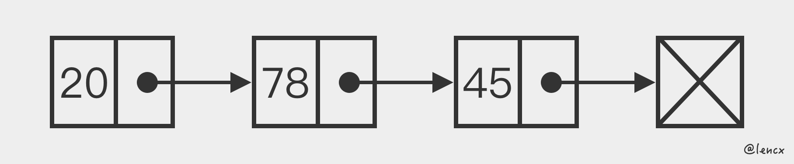
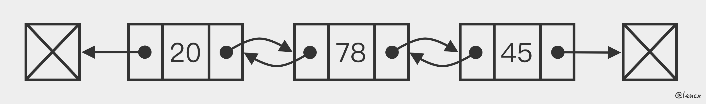
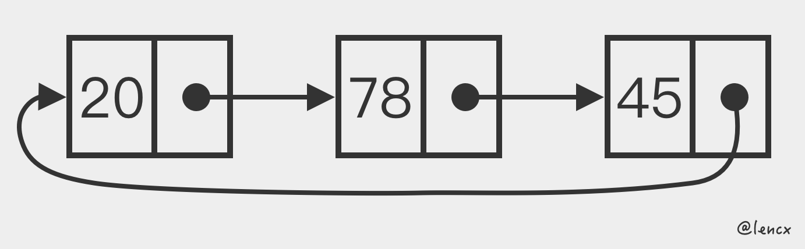

# 线性表

线性表(`linear list`)，是由`n(n≥0)`个`数据`元素(结点) `a[0], a[1], a[2]..., a[n-1]`组成的`有限序列`。

## 链表

链表(`linked list`)，是一种基础数据结构，是一种`线性表`，但是并不会按线性的顺序存储数据，而是在每一个节点里存到下一个节点的`指针`(`Pointer`)。由于不必须按顺序存储，链表在插入的时候可以达到`O(1)`的`复杂度`。

### 单链表

单向链表(`singly linked list`)，其节点包含两个字段：整数值和到下一个节点的链接。

### 双链表

双向链表(`doubly linked list`)，其节点包含三个字段：整数值，指向下一个节点的链接和指向上一个节点的链接，既能向前查询也可以向后查询。

### 循环单链表

循环单链表(`circular linked list`)，单链表尾部的指针指向头节点。

