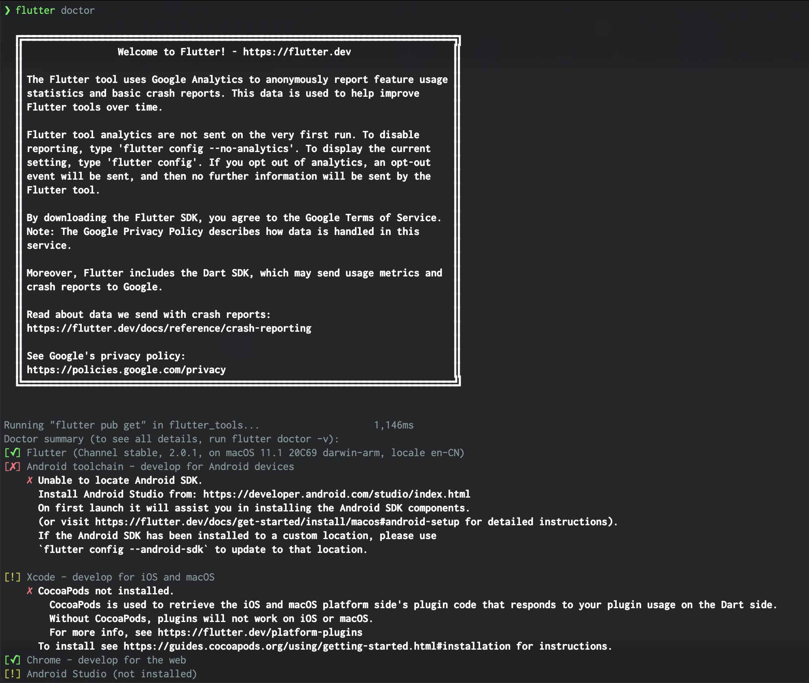
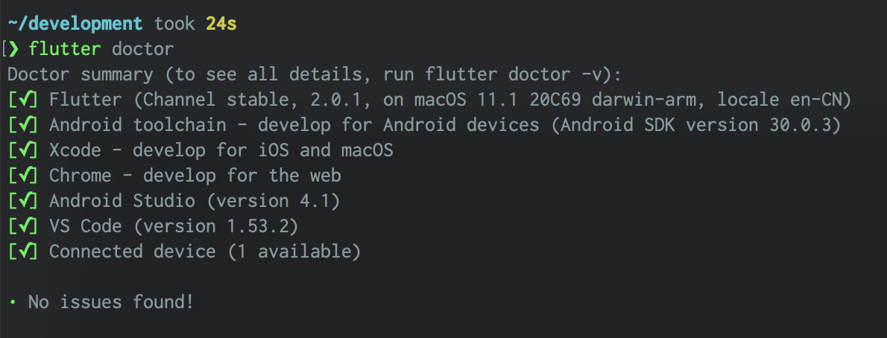

# Flutter

## 环境安装

* [Flutter macOS](https://flutter.dev/docs/get-started/install/macos)

  ```bash
  cd ~/development
  unzip ~/Downloads/flutter_macos_2.0.1-stable.zip
  ```

* [Android Studio](https://developer.android.com/studio)

  ```bash
  # flutter config --android-sdk
  flutter doctor --android-licenses
  ```

* [CocoaPods](https://guides.cocoapods.org/using/getting-started.html#installation)

  ```bash
  sudo gem install cocoapods
  ```




## 创建和运行APP

```bash
flutter create my_app

cd my_app

open -a Simulator

flutter run
```
