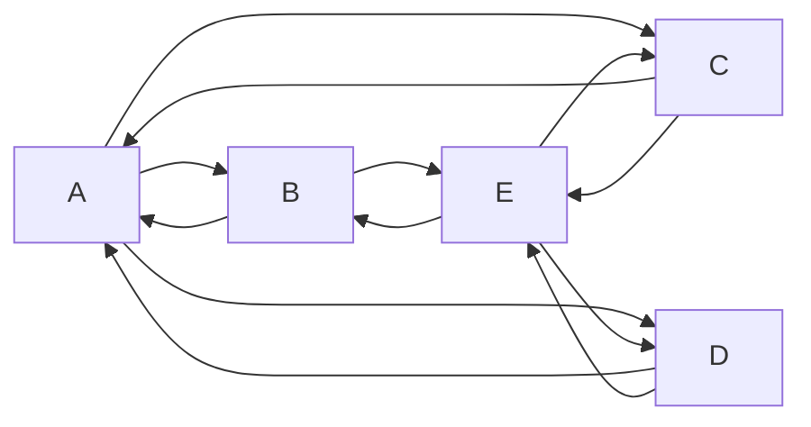

# Chapter 1

Here is an inline example, $ \pi(\theta) $,

an equation,

$$ \nabla f(x) \in \mathbb{R}^n, $$

and a regular \$ symbol.

```rust,editable
fn main() {
  println!("hello book");
}
```



