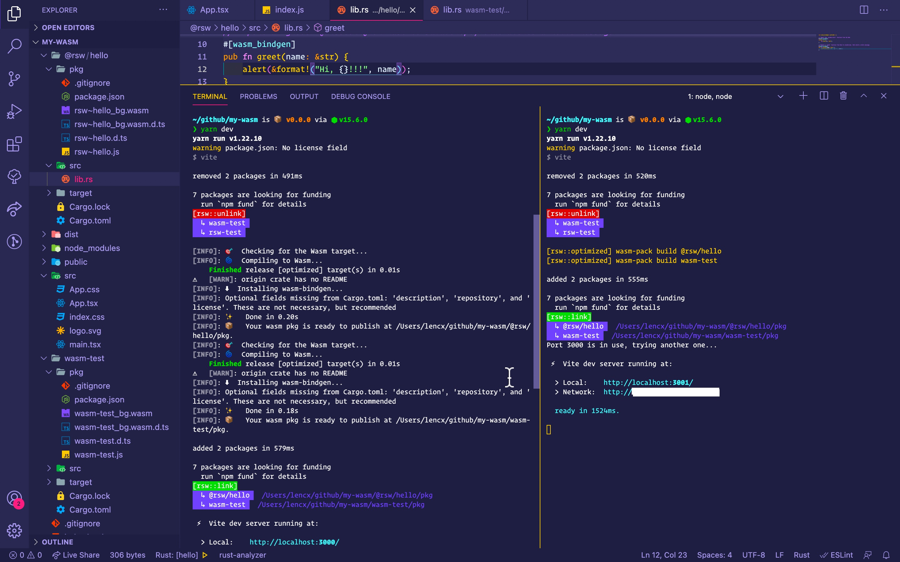
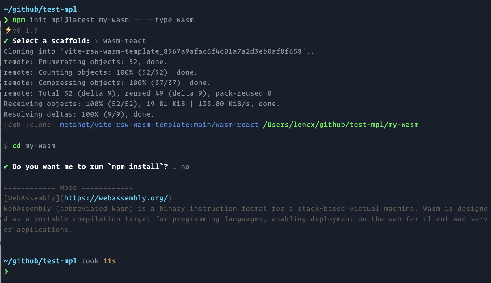

# WebAssembly入门

---

## Wasm是什么?

> [MDN 官方文档](https://developer.mozilla.org/en-US/docs/WebAssembly)是这样给出定义

`WebAssembly` (为了书写方便，简称 `Wasm` )是一种新的编码方式，可以在现代的网络浏览器中运行 － 它是一种低级的类汇编语言，具有紧凑的二进制格式，可以接近原生的性能运行，并为诸如 C / C ++ 等语言提供一个编译目标，以便它们可以 Web 上运行。它也被设计为可以与 JavaScript 共存，允许两者一起工作。

对于网络平台而言，WebAssembly 具有巨大的意义——它提供了一条途径，以使得以各种语言编写的代码都可以以接近原生的速度在 Web 中运行。在这种情况下，以前无法以此方式运行的客户端软件都将可以运行在 Web 中。

WebAssembly 被设计为可以和 JavaScript 一起协同工作——通过使用 WebAssembly 的 JavaScript API，你可以把 WebAssembly 模块加载到一个 JavaScript 应用中并且在两者之间共享功能。这允许你在同一个应用中利用 WebAssembly 的性能和威力以及 JavaScript 的表达力和灵活性，即使你可能并不知道如何编写 WebAssembly 代码。

---

## 环境安装及简介

### 1. [Rust](https://www.rust-lang.org/zh-CN/learn/get-started)

> 一门赋予每个人 \
> 构建可靠且高效软件能力的语言。

安装

```bash
# macOS
curl --proto '=https' --tlsv1.2 -sSf https://sh.rustup.rs | sh

# 其他安装方式
# https://forge.rust-lang.org/infra/other-installation-methods.html
```

常用命令

```bash
# 版本更新
rustup update

# 查看版本
cargo --version

# 构建项目
cargo build

# 运行项目
cargo run

# 测试项目
cargo test

# 为项目构建文档
cargo doc

# 将库发布到 crates.io
cargo publish
```

```bash
# nightly rust
rustup toolchain install nightly

rustup toolchain list

rustup override set nightly
```

### 2. [Node.js](https://nodejs.org/en/download)

> Node.js 是基于 Chrome 的 V8 JavaScript 引擎构建的 JavaScript 运行时

### 3. [wasm-pack](https://github.com/rustwasm/wasm-pack)

> 用于构建和使用您希望与 JavaScript，浏览器或 Node.js 互操作的 Rust 生成的 WebAssembly。

安装

```bash
# macOS
curl https://rustwasm.github.io/wasm-pack/installer/init.sh -sSf | sh

# 其他安装方式
# https://rustwasm.github.io/wasm-pack/installer
```

常用命令

```bash
# 创建
# https://rustwasm.github.io/docs/wasm-pack/commands/new.html
wasm-pack new <name> --template <template> --mode <normal|noinstall|force>

# 构建
# https://rustwasm.github.io/docs/wasm-pack/commands/build.html
wasm-pack build
  [--out-dir <out>]
  [--out-name <name>]
  [--<dev|profiling|release>]
  [--target <bundler|nodejs|web|no-modules>]
  [--scope <scope>]
  [mode <normal|no-install>]

# 测试
# https://rustwasm.github.io/docs/wasm-pack/commands/test.html
wasm-pack test

# 发包
# https://rustwasm.github.io/docs/wasm-pack/commands/pack-and-publish.html
# npm pack
wasm-pack pack
# npm publish
wasm-pack publish
```

### 4. [rsw-node](https://github.com/lencx/rsw-node) - 部署时构建wasm

`wasm-pack build` 在远程部署时执行，零依赖，可以安装到全局，直接使用 `rsw` 命令。也可以和 `vite-plugin-rsw` 插件配合使用

```bash
# 全局安装，执行 `rsw -h` 可查看帮助
npm i -g rsw-node

# ---------------------------------

# 项目中安装 rsw
npm i -D rsw-node

# 或者
yarn add -D rsw-node
```

**`Step1.`** 需要在项目根路径下创建 `.rswrc.json` 文件，例如

```json
{
  "root": ".", // 默认为项目根路径，支持自定义路径，但是不可以超出项目根路径
  "crates": [
    "@rsw/chasm", // npm org
    "@rsw/game-of-life", // npm org
    { "name": "rsw-hello", "outDir": "custom/path" } // npm package，自定义输出路径
  ]
}
```

**`Step2.`** 当配置好 `.rswrc.json` 后，就可以在项目根路径下执行 `rsw` 命令，或者和 `vite-plugin-rsw` 配合使用，在 `package.json` 中添加如下代码。

```json
{
  "scripts": {
    "rsw:deploy": "rsw && npm run build"
  },
}
```

具体使用，可以查看 [lencx/learn-wasm](https://github.com/lencx/learn-wasm)

* [.rswrc.json](https://github.com/lencx/learn-wasm/blob/main/.rswrc.json)
* [package.json](https://github.com/lencx/learn-wasm/blob/main/package.json#L7)
* [vite.config.ts](https://github.com/lencx/learn-wasm/blob/main/vite.config.ts#L8-L16)
* [.github/workflows/deploy.yml](https://github.com/lencx/learn-wasm/blob/main/.github/workflows/deploy.yml)


### 5. [Vite](https://vitejs.dev)

> 下一代前端工具

**[vite-plugin-rsw](https://github.com/lencx/vite-plugin-rsw)：vite插件，简称 `Rsw` - 集成 `wasm-pack` 的CLI**

* 支持rust包文件热更新，监听 `src` 目录和 `Cargo.toml` 文件变更，自动构建
* vite启动优化，如果之前构建过，再次启动 `npm run dev` ，则会跳过 `wasm-pack` 构建
* 通过配置 `isLib` 为 `true` ，在执行 `npm run build` 时会生成可发布的npm包
* 友好的错误提示：浏览器端弹窗 + 控制台及终端命令行

```bash
# 在vite项目中安装
npm i -D vite-plugin-rsw
# or
yarn add -D vite-plugin-rsw
```




### 6. [create-mpl](https://github.com/lencx/create-mpl)

> 脚手架 - ⚡️在几秒钟内创建一个项目！维护了多种项目模板。

```bash
# 根据命令行提示，输入项目名称，App 类型选择 `WebAssembly`，然后选择模板初始化项目
# template: `wasm-react` or `wasm-vue`
npm init mpl@latest my-wasm
```

直接指定 App 类型

```bash
# npm 6.x
npm init mpl@latest my-app --type wasm

# npm 7+, extra double-dash is needed:
npm init mpl@latest my-app -- --type wasm
```



## 快速开始

* 在原有 `vite` 项目中使用，只需安装配置 `vite-plugin-rsw` 插件即可。
* 新项目可以使用 `vite` 提供的 `@vitejs/app` 初始化项目，然后安装配置 `vite-plugin-rsw` 。
* 或者使用脚手架 `create-xc-app` 初始化项目，模板包含 `wasm-react` 和 `wasm-vue` ，会定期更新维护相关版本依赖。

### 项目结构

```bash
# 推荐目录结构
[my-wasm-app] # 项目根路径
|- [wasm-hey] # npm包 `wasm-hey`
|    |- [pkg] # 生成 wasm 包的目录
|    |    |- wasm-hey_bg.wasm # wasm 文件
|    |    |- wasm-hey.js # 包入口文件
|    |    |- wasm-hey_bg.wasm.d.ts # ts 声明文件
|    |    |- wasm-hey.d.ts # ts 声明文件
|    |    |- package.json
|    |    `- ...
|    |- [src] # rust 源代码
|    | # 了解更多: https://doc.rust-lang.org/cargo/reference/cargo-targets.html
|    |- [target] # 项目依赖，类似于 npm 的 `node_modules`
|    | # 了解更多: https://doc.rust-lang.org/cargo/reference/manifest.html
|    |- Cargo.toml # rust 包管理清单
|    `- ...
|- [@rsw] # npm 组织包
|     |- [hey] # @rsw/hey, 目录结构同 `wasm-hey`
|     `- ...
| # 设置 `isLib` 为 true 时，会默认在 `libs` 目录下生成的npm包
| # 可以通过设置 `libRoot` 修改默认路径
|- [libs]
|     |- [@rsw]
|     `- [wasm-hey]
|- [node_modules] # 前端的项目包依赖
|- [src] # 前端源代码(可以是 vue, react, 或其他)
| # 了解更多: https://nodejs.dev/learn/the-package-json-guide
|- package.json # `npm` 或 `yarn` 包管理清单
| # 了解更多: https://vitejs.dev/config
|- vite.config.ts # vite 配置文件
| # 了解更多: https://www.typescriptlang.org/docs/handbook/tsconfig-json.html
|- tsconfig.json # typescript 配置文件
` ...
```

乍一看，可能会觉得目录有点复杂，其实它就是一个标准的基于 `vite` 前端项目，然后，在根路径下去添加我们需要构建的wasm包(一个 rust crate 会对应生成一个 wasm 包，可单独发布到 npm 上)

### 创建Wasm包

```bash
# 两种方式创建

# 1.
# 如果报错，可查看：https://github.com/rustwasm/wasm-pack/issues/907
wasm-pack new <name>

# 2.
# name 可以是 npm 组织
# 例：cargo new --lib @rsw/hello
# 需要手动配置 Cargo.toml
cargo new --lib <name>
```


### 项目配置

> 以react项目为例

**Step1: 配置 Vite 插件** - `vite.config.ts`

```js
import reactRefresh from '@vitejs/plugin-react-refresh';
import { defineConfig } from 'vite';
import ViteRsw from 'vite-plugin-rsw';

export default defineConfig({
  plugins: [
    reactRefresh(),
    // 查看更多：https://github.com/lencx/vite-plugin-rsw
    ViteRsw({
      // 指定包管理器 - `pnpm` `yarn` `npm`，默认 `npm`
      cli: 'npm',
      // 自定义 rust 包路径，默认项目根路径
      root: '.',
      // wasm-pack build 参数 - `dev` `release` `profiling`，默认 `dev`
      profile: 'dev',
      // 编译目标 - `bundler` `web` `nodejs` `no-modules`，默认 `web`
      target: 'web',
      // 如果包在 `unLinks` 和 `crates` 都配置过
      // 会执行，先卸载(npm unlink)，再安装(npm link)
      // 例如下面会执行
      // `npm unlink wasm-hey rsw-test`
      unLinks: ['wasm-hey', 'rsw-test'],
      // 项目根路径下的 rust 项目
      // `@`开头的为 npm 组织
      // 例如下面会执行:
      // `npm link wasm-hey @rsw/hey`
      // 因为执行顺序原因，虽然上面的 unLinks 会把 `wasm-hey` 卸载
      // 但是这里会重新进行安装
      // 同时支持字符串(string)和对象(RswCrateOptions)形式的配置
      // https://github.com/lencx/vite-plugin-rsw/issues/8
      // https://github.com/lencx/vite-plugin-rsw/blob/main/src/types.ts#L30
      crates: [
        'wasm-hey', // npm package
        '@rsw/hey', // npm org package
        { name: '@rsw/hello', outDir: 'custom/path' }, // 自定义输出路径
      ],
    }),
  ],
})
```

**Step2: 配置 Rust 项目清单** - `wasm-hey/Cargo.toml`

```toml
# ...

# https://github.com/rustwasm/wasm-pack/issues/886
# https://developers.google.com/web/updates/2019/02/hotpath-with-wasm
[package.metadata.wasm-pack.profile.release]
wasm-opt = false

# See more keys and their definitions at https://doc.rust-lang.org/cargo/reference/manifest.html
[lib]
crate-type = ["cdylib", "rlib"]

[profile.release]
opt-level = "s"

[dependencies]
wasm-bindgen = "0.2.70"
```

**Step3: 添加 Rust 代码** - `wasm-hey/src/lib.rs`

```rust
use wasm_bindgen::prelude::*;

// Import the `window.alert` function from the Web.
#[wasm_bindgen]
extern "C" {
    fn alert(s: &str);
}

// Export a `greet` function from Rust to JavaScript, that alerts a hello message.
#[wasm_bindgen]
pub fn greet(name: &str) {
    alert(&format!("Hello, {}!", name));
}
```

**Step4: React 项目中调用 Wasm 方法** - `src/App.tsx`

```jsx
import React, { useEffect } from 'react';
import init, { greet } from 'wasm-hey';

import logo from './logo.svg';
import './App.css';

function App() {
  useEffect(() => {
    // wasm 初始化，在调用 `wasm-hey` 包方法时
    // 必须先保证已经进行过初始化，否则会报错
    // 如果存在多个 wasm 包，则必须对每一个 wasm 包进行初始化
    init();
  }, [])

  const handleHey = () => {
    // 调用greet方法
    greet('wasm');
  }

  return (
    <div className="App">
      <header className="App-header">
        
        <p>Hello WebAssembly!</p>
        <p>Vite + Rust + React</p>
        <p>
          <button onClick={handleHey}>hi wasm</button>
        </p>
        <p>Edit <code>App.tsx</code> and save to test HMR updates.</p>
      </header>
    </div>
  )
}

export default App
```

## 常见问题汇总

### Rsw插件

* 插件内部是通过 `npm link` 的形式实现的wasm包安装，在一些极端场景下会出现，找不到依赖的安装包，导入的包不存在等错误，可以根据提示路径删除其link的文件，重新启动 `npm run dev` 可以解决。
* `npm link` 命令会把包 `link` 到全局环境，如果在多个项目使用相同wasm包名，可能会导致报错，解决办法，在全局npm的`node_modules` 中删除该包即可。推荐不同项目使用不同wasm包名避免此类异常。
* 插件是处于Vite开发模式下运行构建，所以至少执行过一次 `npm run dev` ，生成 `wasm` 包之后，再执行 `npm run build` ，否则也会报错，到不到 `.wasm` 文件之类的。
* 插件API可以配置需要卸载的包(仅限于之前通过插件配置 `crates` 中rust项目)
* npm ERR! EEXIST: file already exists

  ```bash
  # https://docs.npmjs.com/cli/v6/commands/npm-link
  # npm link uses the global prefix (see npm prefix -g for its value)
  # /Users/lencx/.nvm/versions/node/v15.6.0
  npm prefix -g

  # after removing the folder, try again `npm run dev`
  rm -rf /Users/lencx/.nvm/versions/node/v15.6.0/lib/node_modules/@rsw/chasm
  ```

  

### 前端

```js
// init 是 wasm 实例的初始化方法
// 在调用其他方法之前，必须先调用一次 init 方法，否则会报错
// init 会请求 `.wasm` 文件并且返回一个 `Promise`
import init, { greet } from 'wasm-test';

// -----------------------------------------

// 调用init方法，有两种方式

// 1.
// 在 react，vue3 中可以将其抽离为 `hook` 组件,
// 在进入生命周期时调用
init();

// 在调用过 init 方法之后，可以单独调用 greet 方法
greet('wasm');

// 2.
// 在初始化之后直接调用方法
init()
  .then(wasm => wasm.greet('wasm'));
```

---

## 相关链接

* [RSW 资源清单 - lencx/awesome-rsw](https://github.com/lencx/awesome-rsw)
* [Wasm 学习项目 - lencx/learn-wasm](https://github.com/lencx/learn-wasm)
* [Vite 插件 Rsw - lencx/vite-plugin-rsw](https://github.com/lencx/vite-plugin-rsw)
* [项目脚手架 - lencx/create-mpl](https://github.com/lencx/create-mpl)
* [Awesome WebAssembly](https://github.com/lencx/awesome/blob/main/WebAssembly.md)

---

* [WebAssembly 官网](https://webassembly.org)
* [Rust 官网 - 一门赋予每个人 构建可靠且高效软件能力的语言](https://www.rust-lang.org)
* [Nodejs 官网 - 基于 Chrome 的 V8 JavaScript 引擎构建的 JavaScript 运行时](https://nodejs.org)
* [Vite 官网 - 下一代前端工具](https://vitejs.dev)
* [wasm-pack - Rust => WebAssembly](https://rustwasm.github.io/wasm-pack)
* [rust-to-wasm](https://developer.mozilla.org/en-US/docs/WebAssembly/Rust_to_wasm)
* [wasm-bindgen](https://github.com/rustwasm/wasm-bindgen)
